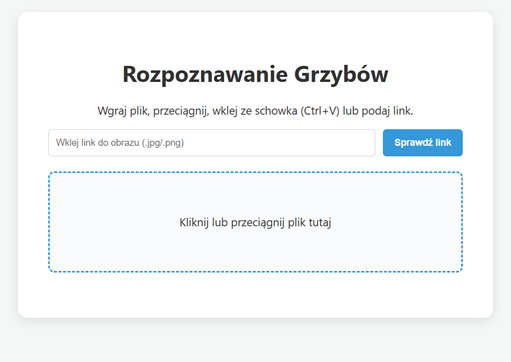
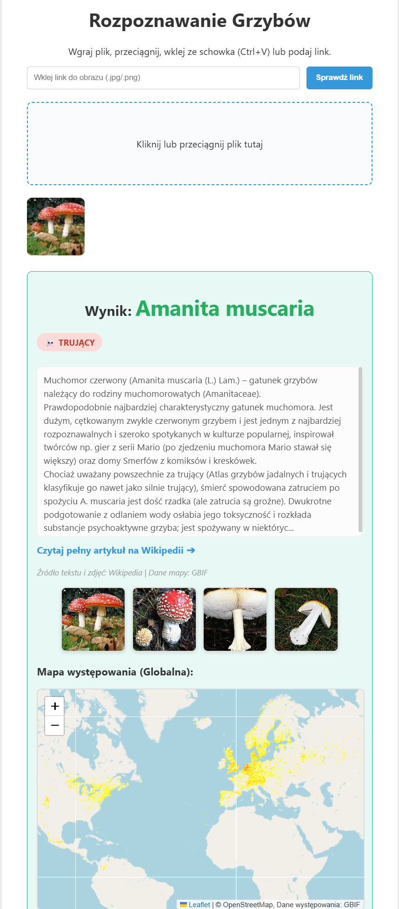

# 🍄 Mushroom Recognition System
### Testowy system rozpoznawania na zbiorze 95 gatunków grzybów

Kompleksowy system doradczy oparty na głębokim uczeniu maszynowym, który pozwala na błyskawiczną identyfikację gatunków grzybów na podstawie zdjęć, weryfikację ich toksyczności oraz wizualizację globalnego występowania.

---

## 🌟 O projekcie

Projekt został zrealizowany w ramach przedmiotu **Systemy rozpoznawania obrazów** na **Politechnice Świętokrzyskiej**. Celem było stworzenie narzędzia wspomagającego grzybiarzy, które łączy nowoczesne techniki wizji komputerowej z danymi z otwartych baz biologicznych.

### Główne funkcjonalności:
* **Klasyfikacja AI:** Rozpoznawanie 95 gatunków grzybów przy użyciu sieci neuronowej **ResNet50**.
* **Bezpieczeństwo:** Natychmiastowe ostrzeżenia o toksyczności (Jadalny / Trujący / Niejadalny) z lokalnej bazy wiedzy.
* **Integracja z Wikipedią:** Automatyczne pobieranie opisów encyklopedycznych i galerii zdjęć referencyjnych.
* **Interaktywne Mapy:** Wizualizacja globalnego występowania gatunku na mapie cieplnej (dane z GBIF API).
* **Fault Tolerance:** Odporność na brak internetu i błędy linków URL (dekodowanie Base64, obsługa timeoutów).

---

## 🛠 Technologie

### Backend i AI
* **Python 3.10**
* **PyTorch / Torchvision** (Model ResNet50)
* **Flask** (Serwer aplikacji)

### Frontend
* **HTML5 & CSS3** (Responsive Design, Drag & Drop UI)
* **JavaScript (Vanilla)**
* **Leaflet.js** (Interaktywne mapy)

### Zewnętrzne API
* **Wikimedia API** (Opisy i multimedia)
* **GBIF Maps API** (Dane geolokalizacyjne)

---

## 📋 Instrukcja instalacji i uruchomienia

### Wymagania
* Zainstalowany Python (zalecany 3.9+)
* Pobrane wagi modelu `mushroom_model.pth` w głównym folderze.

### Kroki instalacji
1.  **Sklonuj repozytorium:**
    ```bash
    git clone [git clone https://github.com/stuckelm03/Mushroom-Recognition-System.git](https://github.com/stuckelm03/Mushroom-Recognition-System.git)
    cd mushroom-recognition-system
    ```

2.  **Stwórz wirtualne środowisko (opcjonalnie):**
    ```bash
    python -m venv venv
    source venv/bin/activate  # Linux/Mac
    venv\Scripts\activate     # Windows
    ```

3.  **Zainstaluj wymagane biblioteki:**
    ```bash
    pip install -r requirements.txt
    ```

4.  **Uruchom aplikację:**
    ```bash
    python app.py
    ```
5.  Otwórz przeglądarkę i wejdź na: `http://127.0.0.1:5000`

---

## 🖥 Interfejs Użytkownika




*Rysunek 1: Główny interfejs aplikacji z obszarem Drag & Drop.*



*Rysunek 2: Przykładowy raport dla gatunku Amanita muscaria.*

---

## 👥 Autorzy
* **Mateusz Z.**
* **Maciej S.**

*Projekt realizowany na Wydziale Elektrotechniki, Automatyki i Informatyki Politechniki Świętokrzyskiej.*
